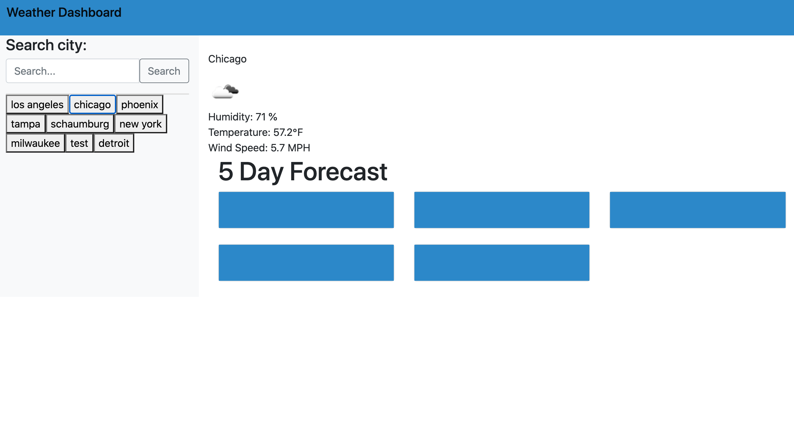

# Weather-Dashboard

> A website that displays a cities weather.

## Table of contents
* [General info](#general-info)
* [Setup](#setup)
* [Screenshot](#Screenshot)
* [Features](#features)
* [Status](#status)
* [Inspiration](#inspiration)
* [Contact](#contact)

## General info
A weather dashboard that displays the weather each day. User enters the name of a city or state in the search field. The app will display the current temperature, humidity, wind speed, and UV Index.

## Setup

To get this project up and running follow the steps bellow.

1. Navigate to the main page of the repository
2. Under the repository name, click Clone or download
3. In the Clone with HTTPSs section, click the copy
4. Open Terminal
5. Change the current working directory to the location where you want the cloned directory to be made.
6. Type ‘git clone’ and then paste the URL you copied
	- $ git clone https://github.com/aidabyte/Weather-Dashboard.git
7. Press Enter. Your local clone will be created.

## Screenshot

## Features
1. Type in a city
2. Date,temperature,humidity,and wind speed will show
3. Will store the recent city that was typed in

## Status
Project is: _in progress_ because I am still learning.

## Inspiration
Project inspired by homework given by Northwestern Coding bootcamp 2020

## Contact
Created by [@aida](https://https://github.com/aidabyte) - feel free to contact me!
